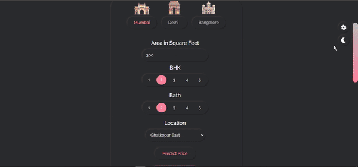

# House Price Prediction using Machine Learning

## Overview

This project predicts house prices based on property features such as location, area, number of bedrooms, and bathrooms.
It uses machine learning regression models trained on historical housing data from major Indian cities.

---

## Purpose

The goal of this project is to understand how machine learning can be applied to real-world price prediction problems and how trained models can be integrated into a backend application.

---

## Machine Learning Model

* **Model Used:** Linear Regression
* **Library:** scikit-learn

Linear Regression is used to predict a continuous numerical value, which makes it suitable for house price estimation.

---

## Model Training

* Housing data is cleaned and preprocessed
* Location data is converted using one-hot encoding
* Models are trained separately for each city
* Trained models are saved using Pickle
* Feature columns are stored in JSON files

---

## Tools Used

* Python
* NumPy, Pandas
* scikit-learn
* Flask
* Pickle, JSON

---

## How It Works

1. User inputs property details
2. A feature vector is created
3. The city-specific model predicts the price
4. The estimated price is returned in INR (Lakhs)

## Web App Preview

### Prediction

### UI

### Dark & Light Theme

---

## Learning Outcome

This project demonstrates a complete machine learning pipeline from training to real-time prediction.

---

If you want it even shorter for a **resume project description**, tell me and I’ll compress it into 2–3 lines.
